# Production-Style Kubernetes Platform on AWS with Terraform Provisioning, CI/CD Pipeline, Observability, and Security Hardening

This project demonstrates a production-style DevOps platform built on AWS using Infrastructure-as-Code, Kubernetes, CI/CD automation, monitoring, logging, and security best practices.

The goal of this project is to simulate how modern cloud-native applications are deployed, monitored, secured, and automated in real industry environments, while keeping the infrastructure cost low enough to run on AWS Free Tier resources.

The platform provisions AWS infrastructure using Terraform, deploys a Kubernetes cluster using K3s on EC2 instances, integrates Jenkins CI/CD with Amazon ECR, exposes services via TLS ingress with a custom domain, and implements observability using Prometheus, Grafana, Loki, and Alert-manager.
It also includes RBAC, NetworkPolicies, Secrets management, and automated pod healing using Kubernetes CronJobs.

## Architecture Diagram:

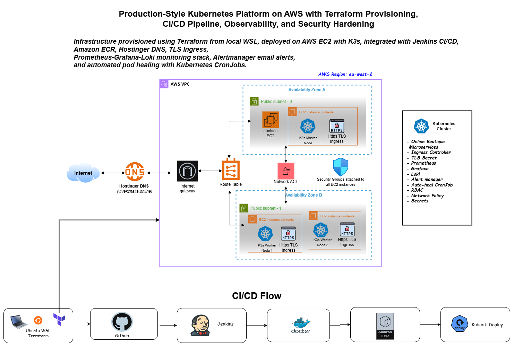 

## AWS Infrastructure: 

VPC runs in eu-west-2 region
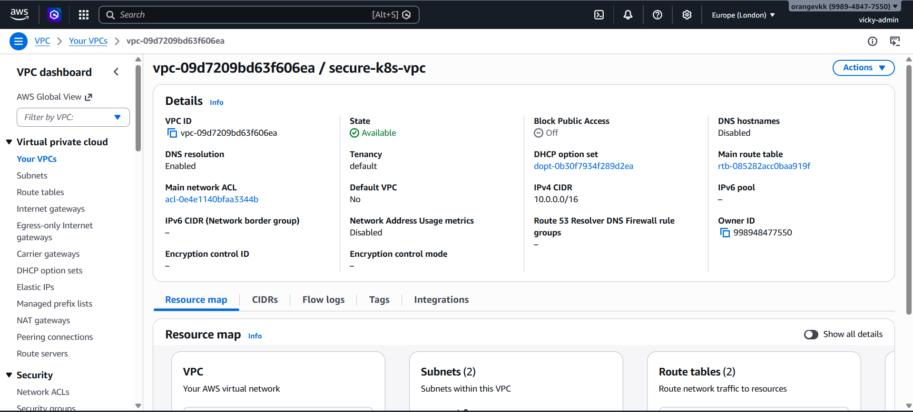

This project has two subnets which are attached to route tables and internet gateways
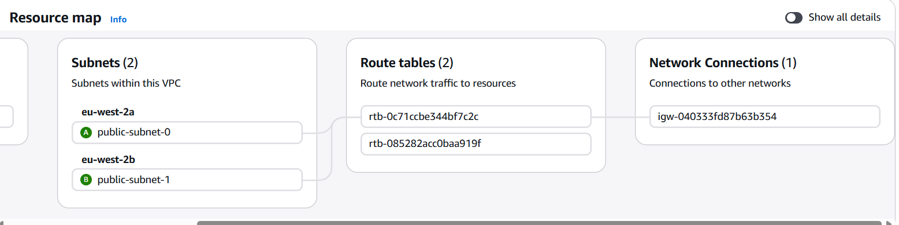

This project runs on four ec2 instances, each of them have attached security groups
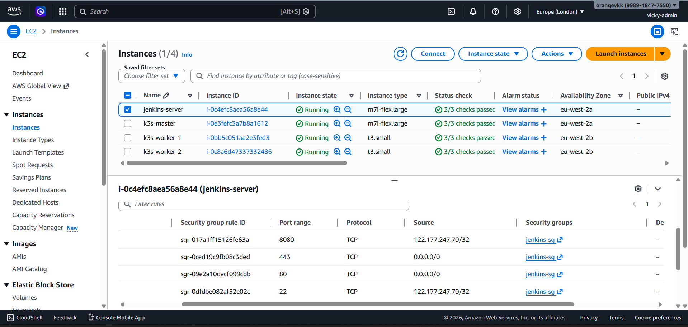

## Kubernetes Cluster:

All three nodes which are inside ec2 instances are containerized 
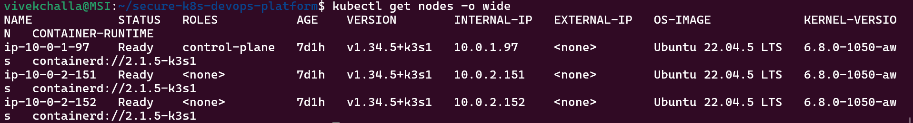

All pods are running successfully 
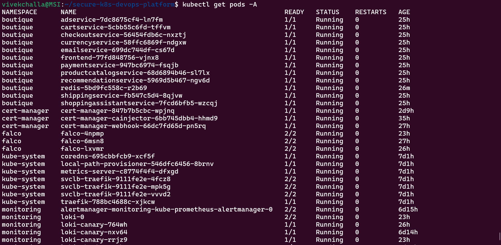

## Boutique Application:

Boutique website is successfully running and website url has secure connection with https

  ▶️ **Click below to watch full project walkthrough**
  
  
  

## Jenkins CI/CD Pipeline:

jenkins server has secure https connection

  ▶️ **Click below to watch jenkins CI/CD overview**
  
  
  

## Amazon ECR: 

All the microservices are containerd and stored in ecr registry

  ▶️ **Click below to watch AWS ECR registry with versioned tags attached to frontend**
  
  
  

## Grafana Dashboard:

  ▶️ **Click below to watch Grafana dashboard**
  
  
  

## Prometheus:

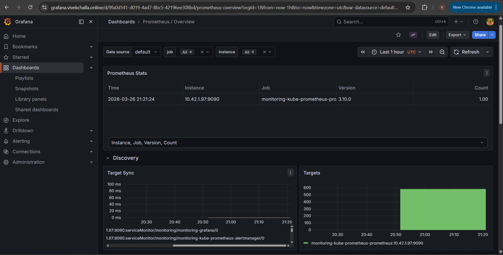

## Alert-manager Email: 

Monitoring is working successfully with alerts getting to my email address
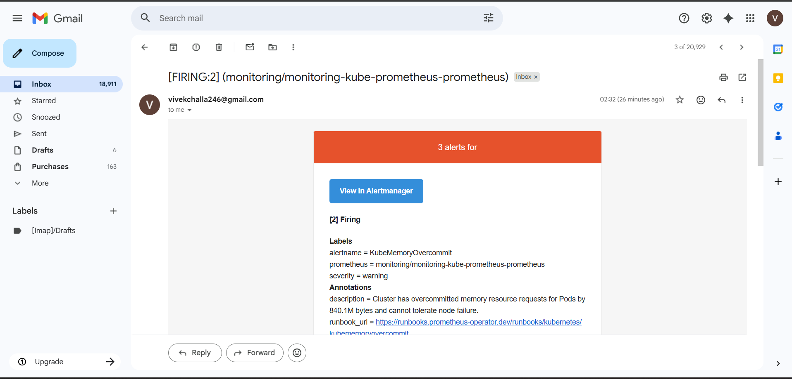

## Security (Secrets + RBAC): 

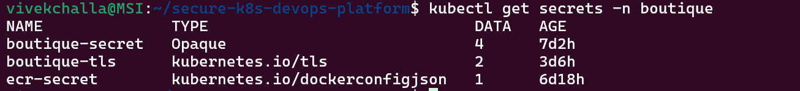

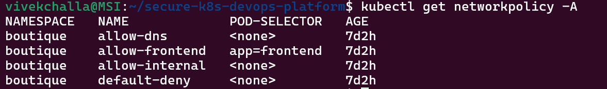

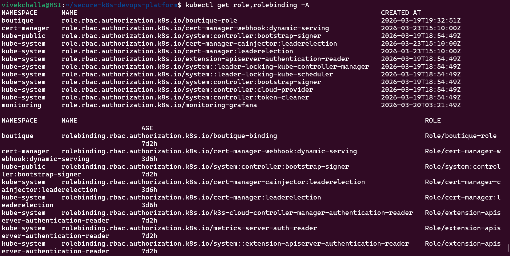

## Auto-Healing: 

kubernetes cronjob is working fine, when ever there is a trouble, it will automatically restarts pods
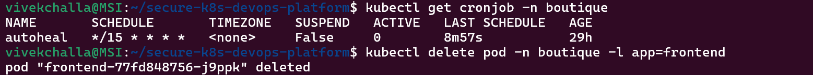

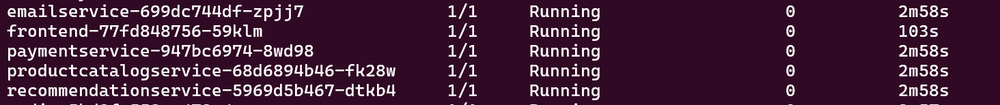

## Project Purpose

Modern software companies rely on cloud platforms, automation, and container orchestration to deliver applications quickly and reliably.
Traditional manual deployment processes are slow, error-prone, and difficult to scale.

A unified DevOps platform helps automate the entire software lifecycle, including infrastructure provisioning, build pipelines, deployment, monitoring, and recovery.
Modern DevOps platforms combine CI/CD, security, and observability into a single workflow to enable faster and more reliable software delivery.

This project was created to demonstrate how a real-world DevOps platform can be built from scratch using open-source tools and AWS.

## Industry Problems This Project Addresses

### 1. Manual Infrastructure Management

Without Infrastructure as Code, infrastructure must be created manually, which leads to configuration drift and inconsistent environments.

Infrastructure-as-Code allows environments to be reproducible, version-controlled, and automated, enabling faster and safer deployments.

This project uses Terraform to provision all AWS resources.

### 2. Slow and Risky Deployments

Manual deployments increase downtime and risk of human error.

CI/CD pipelines automate build, test, and deployment steps, enabling faster and more reliable releases while reducing manual effort.

This project integrates:

- GitHub
- Jenkins
- Docker
- Amazon ECR
- kubectl deployment

### 3. Lack of Observability

In modern distributed systems, failures may occur in multiple services at the same time.

Monitoring and observability tools like Prometheus, Grafana, and Loki allow engineers to detect issues early, correlate logs with metrics, and respond quickly to incidents.

This project implements full observability stack.

### 4. No Automated Recovery

In real production systems, services must recover automatically when failures occur.

Kubernetes automation combined with alerting and scripts can restart unhealthy pods and reduce downtime.

This project includes:

- Alert-manager email alerts
- Auto-heal script
- Kubernetes CronJob automation

### 5. Lack of Security Controls

Production systems must enforce access control, network isolation, and secret management.

This project includes:

- RBAC
- NetworkPolicy
- Security Groups
- TLS ingress
- Secrets

## Why Terraform Was Used

Terraform was used to provision AWS infrastructure from local WSL.

Benefits:

- Infrastructure as Code
- Version-controlled environment
- Reproducible deployments
- Automated provisioning

Terraform created:

- VPC
- Public subnets
- Route tables
- Internet gateway
- Network ACL
- Security groups
- EC2 instances

This reflects how real cloud infrastructure is managed in industry.

## Why Public Subnets Were Used Instead of Private Subnets

In real production environments, Kubernetes nodes usually run in private subnets with a NAT Gateway.

However, NAT Gateways are not part of AWS Free Tier and incur hourly and data transfer charges.
AWS charges for every NAT Gateway hour and for data processed through it.

Private subnets require NAT to access the internet, while public subnets can connect directly through an Internet Gateway.

To reduce cost and keep the project within free-tier limits, public subnets were used for all EC2 instances.

## How this can be improved to production standard

Production architecture would include:

- Private subnets for nodes
- Public subnet for load balancer
- NAT gateway for outbound traffic
- Bastion host
- Multi-AZ load balancing

## Why K3s Instead of EKS or Full Kubernetes

Full Kubernetes also requires more CPU, memory, and configuration.

K3s is a lightweight Kubernetes distribution designed for environments with limited resources.
It runs all control plane components in a single binary and starts faster with lower resource usage.

K3s is commonly used for development, edge computing, and small clusters where full Kubernetes would be too heavy.

Because this project runs on small EC2 instances, K3s was chosen instead of EKS.

## Production alternative

Production environments would use:

- Amazon EKS
- Managed node groups
- Private subnets
- Auto scaling
- Load balancers

## Why Observability Stack Was Added

Kubernetes alone does not provide complete monitoring.

Prometheus collects metrics
Grafana visualizes data
Loki stores logs
Alertmanager sends alerts

Monitoring allows teams to detect performance problems, resource issues, and failures before users notice.

This project uses full observability stack to simulate real production monitoring.

## Why CI/CD Pipeline Was Implemented

Modern applications are deployed many times per day.

CI/CD pipelines automate the process from code commit to deployment, reducing downtime and improving reliability.

Pipeline in this project:

GitHub → Jenkins → Docker → ECR → Kubernetes

This reflects real industry workflow.

## Why Auto-Healing Was Added

In real production, systems must recover automatically.

Auto-healing reduces downtime and manual intervention.

This project uses:

- Python script
- Kubernetes CronJob
- Pod restart automation

This simulates real SRE practices.

## Data Storage Architecture

This project uses a microservices demo application where data persistence is minimal and primarily designed for demonstration purposes.

- Cart data is stored in Redis (in-memory cache)
- Product data is served by microservices and not stored in a database
- Orders and payments are simulated without persistent storage

This design simplifies the architecture while focusing on DevOps, CI/CD, and infrastructure automation.

### Production Improvement

In a real-world system:

- Use Amazon RDS (PostgreSQL/MySQL)
- Use DynamoDB for scalable NoSQL storage
- Use persistent Redis (ElastiCache)
- Implement backup and recovery strategies

## Architecture Overview

The platform consists of:

- AWS VPC with two public subnets in two availability zones
- EC2 instances running K3s cluster
- Jenkins EC2 for CI/CD
- Microservices were containerized with Docker
- Amazon ECR for container registry
- Hostinger DNS for domain
- TLS ingress for HTTPS
- Prometheus, Grafana, Loki, Alertmanager
- RBAC and NetworkPolicy
- Autoheal CronJob

Infrastructure is provisioned using Terraform from local WSL.

## How This Fits Current Industry

Modern companies use:

- Infrastructure as Code
- Docker
- Kubernetes
- CI/CD pipelines
- Monitoring and logging
- Automated recovery
- Secure networking

This project demonstrates all of these in a single platform.

It reflects real DevOps / Cloud / Platform Engineer workflows.

## Real-World Issues Faced & Solutions

During the development of this platform, several real-world production-like issues were encountered and resolved. These challenges provided deeper understanding of cloud-native systems, debugging, and operational reliability.

### 1. ECR Authentication Failure (ImagePullBackOff)

**Problem:**
After successful deployment, multiple services entered ImagePullBackOff state.

**Root Cause:**
Amazon ECR authentication tokens expire periodically. Kubernetes was unable to pull images because the stored imagePullSecret became invalid.

**Solution:**
Recreated the Kubernetes docker registry secret using a fresh ECR login token and restarted deployments.

**Learning:**
Container registries require periodic authentication refresh. In production, IAM roles or automated secret rotation should be used instead of static credentials.

### 2. Redis Failure Causing Application Crash

**Problem:**
The application returned HTTP 500 errors when adding items to cart.

**Root Cause:**
Redis failed to persist data due to insufficient disk space, triggering stop-writes-on-bgsave-error, which blocked write operations.

**Solution:**
Disabled Redis persistence for the demo environment and restarted the Redis pod.

**Learning:**
Stateful services require proper storage planning. In production, Redis should use persistent volumes or managed services like AWS ElastiCache.

### 3. Jenkins Plugin Dependency Issues

**Problem:**
Jenkins plugins failed to install due to dependency conflicts and outdated versions.

**Root Cause:**
Mismatch between Jenkins core version and plugin requirements.

**Solution:**
Upgraded Jenkins and resolved plugin dependencies manually.

**Learning:**
Version compatibility is critical in CI/CD tools. Always use LTS versions and compatible plugins.

### 4. Kubernetes Authentication Issues (kubeconfig)

**Problem:**
Jenkins was unable to access the Kubernetes cluster.

**Root Cause:**
Incorrect kubeconfig configuration and missing permissions for Jenkins user.

**Solution:**
Configured kubeconfig properly and assigned correct permissions.

**Learning:**
Access control and authentication are critical in distributed systems.

### 5. Node Resource Constraints (Evicted Pods)

**Problem:**
Pods were getting evicted or showing ContainerStatusUnknown.

**Root Cause:**
Limited CPU, memory, and disk space on small EC2 instances.

**Solution:**
Upgraded instance type and cleaned up unused resources.

**Learning:**
Resource planning is essential. Monitoring tools help detect such issues early.

## Future Improvements

### Use Private Subnets and NAT Gateway

- Private subnets for nodes
- Public subnet for load balancer
- NAT Gateway for outbound traffic
- Bastion host for SSH access

### Use Amazon EKS Instead of K3s

K3s was chosen to reduce resource usage and cost.
In production, managed Kubernetes services like Amazon EKS provide better scalability, security, and integration with AWS.

Future improvement:

- Replace K3s with EKS
- Use managed node groups
- Use IAM roles for service accounts

### Use IAM Roles Instead of Static Credentials

This project uses AWS credentials stored in Jenkins for ECR access.
In production, IAM roles should be attached to instances or pods to avoid storing credentials.

Future improvement:

- IAM role for Jenkins EC2
- IAM role for Kubernetes nodes
- IAM roles for service accounts

### Use External Secrets Manager

This project uses Kubernetes secrets for TLS, ECR login, and application credentials.
Production environments usually store secrets in external secret managers.

Future improvement:

- AWS Secrets Manager
- HashiCorp Vault
- External Secrets Operator

### Add Horizontal Pod Autoscaling

Current deployments use fixed replica counts.
Production systems automatically scale pods based on CPU or memory usage.

Future improvement:

- Horizontal Pod Autoscaler
- Cluster autoscaler
- Auto scaling groups

### Add Load Balancer Instead of NodePort

Ingress currently exposes services through node ports and public IP.

Production environments use managed load balancers.

Future improvement:

- AWS ALB / NLB
- Ingress with load balancer
- WAF protection

### Add GitOps Deployment

Deployment is currently triggered from Jenkins.

Production environments often use GitOps tools.

Future improvement:

- ArgoCD
- FluxCD

## Conclusion

This project demonstrates a complete DevOps platform built using AWS, Terraform, Kubernetes, CI/CD, monitoring, and security controls.

It shows how modern cloud-native applications are deployed and managed in real production environments while keeping infrastructure cost low for learning purposes.

The architecture follows industry practices and can be extended to full production systems.

